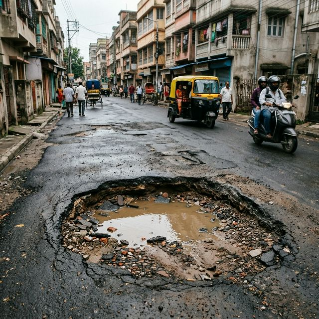

<div align="center">



# 🏙️ NagarDrishti
### AI-Powered Civic Complaint Automation System

*Detect. Verify. Escalate. Resolve.*

[](https://python.org)
[](https://flask.palletsprojects.com)
[](https://ai.google.dev)
[](https://supabase.com)
[](https://ultralytics.com)
[](LICENSE)

**Built in 48 hours · Bikaner Technical University · April 2026**

[🚀 Demo](#-demo) · [📖 Docs](#-installation) · [🤝 Contributors](#-contributors)

</div>

---

## 🔍 What is NagarDrishti?

**NagarDrishti** (नगरदृष्टि — *City Vision*) is an end-to-end AI system that automates the entire lifecycle of a civic complaint — from the moment a pothole is detected by a camera, to the moment a legally-backed complaint lands in a municipal officer's inbox.

> "Transparent data leads to responsive governance."

### The Problem We Solve

- 🚗 **Road damage causes thousands of accidents annually** — Potholes and cracks lead to vehicle damage, injuries, and fatalities, yet most go unreported.
- 📝 **Manual complaint filing is tedious and ignored** — Citizens give up after navigating complex government portals, and their complaints often disappear into bureaucratic black holes.
- 🚫 **Municipalities reject unverified reports as spam** — Without photo evidence, GPS coordinates, and proper documentation, officials dismiss complaints as fake or duplicate.

---

## 🏗️ System Architecture

```
┌─────────────────────────────────────────────────────────────┐
│                      INPUT SOURCES                      
    │
├────────────────────────┬────────────────────────────────────┤
│    🎥 Vision Engine    │       🌐 Citizen Portal            │
│   (Webcam/CCTV/IP)     │    (Web Upload / Manual Form)      │
└───────────┬────────────┴───────────────┬────────────────────┘
            │                            │
            ▼                            ▼
┌─────────────────────────────────────────────────────────────┐
│               🧠 GATEWAY AGENT (Orchestrator)               │
│          Routes · Parses · Builds ComplaintPayload          │
└───────────┬─────────────────────────────────────────────────┘
            │
            ▼
┌─────────────────────────────────┐
│    🔍 VERACITY AGENT            │
│    Stage 1: EXIF Metadata Check │
│    Stage 2: Gemini Vision AI    │
│    Stage 3: Stock Photo Check   │
│    Stage 4: Cross-Validation    │
│    Trust Score → PASS / REJECT  │
└───────────┬─────────────────────┘
            │ (verified only)
            ▼
┌─────────────────────────────────┐
│    ⚖️  LEGAL AGENT              │
│    Cites IPC Section 283        │
│    Motor Vehicles Act S.138     │
│    Drafts official complaint    │
│    Finds municipal department   │
└───────────┬─────────────────────┘
            │
            ▼
┌─────────────────────────────────┐
│    📤 ACTION AGENT              │
│    Generates PDF Report         │
│    Sends Email with Evidence    │
│    Saves to Supabase DB         │
└───────────┬─────────────────────┘
            │
            ▼
┌─────────────────────────────────────────────────────────────┐
│                        OUTPUTS                              │
├───────────────┬───────────────────┬─────────────────────────┤
│   📄 PDF Rpt  │   ✉️ Email Alert   │   🗺️ Public Map Pin    │
└───────────────┴───────────────────┴─────────────────────────┘
```

---

## ✨ Key Features

🎥 **Real-Time Vision Detection**  
YOLO ONNX model detects potholes and cracks from webcam, phone camera, or CCTV with 3-level severity classification.

🛡️ **4-Stage Anti-Fraud Verification**  
EXIF metadata → Gemini Vision AI → Stock photo detection → Cross-validation. Trust score prevents fake reports.

⚖️ **AI-Generated Legal Complaints**  
Gemini AI drafts formal letters citing IPC Section 283 and Motor Vehicles Act Section 138 automatically.

📄 **Professional PDF Reports**  
ReportLab generates complaint PDFs with photo evidence, legal draft, trust score, and GPS coordinates.

✉️ **Automatic Municipal Email**  
Complaint emails with PDF + photo evidence sent directly to the correct municipal department.

🗺️ **Live Complaint Heatmap**  
Leaflet.js interactive map shows GPS-pinned complaints with severity color coding.

📱 **Multi-Camera Support**  
Laptop webcam, Android IP Webcam app, DroidCam, or RTSP CCTV streams all supported.

🔄 **Gemini Model Auto-Fallback**  
If primary model hits quota, auto-switches to backup. Never fails due to API rate limits.

---

## 🛠️ Tech Stack

| Layer | Technology | Purpose |
|-------|------------|---------|
| Vision | YOLO ONNX + OpenCV | Real-time pothole detection |
| AI Agents | Google Gemini 2.5 Flash | Verification + legal drafting |
| Web Framework | Flask 3.0 + Jinja2 | Web app + REST API |
| Database | Supabase (PostgreSQL) | Complaint storage + GPS data |
| PDF Engine | ReportLab | Professional complaint reports |
| Maps | Leaflet.js + OpenStreetMap | Interactive complaint heatmap |
| Email | SMTP + Gmail | Municipal department alerts |
| Model Registry | HuggingFace Hub | ONNX model download |
| Security | Flask-Limiter + Werkzeug | Rate limiting + file validation |
| Geolocation | ipapi.co (IP-based) | Vision engine location detection |

---

## 🚦 Severity Classification

| Level | Label | Trigger | Repair Deadline |
|-------|-------|---------|-----------------|
| 🟢 Level 1 | Safe | Cracks only detected | Within 30 days |
| 🟡 Level 2 | Risky | Pothole < 40% frame coverage | Within 7 days |
| 🔴 Level 3 | High Alert | Pothole ≥ 40% frame coverage | Within 48 hours |

---

## 🚀 Installation

### Prerequisites

- Python 3.10+
- Git
- Gmail account with App Password enabled
- Supabase project (free tier works)
- Google Gemini API key (free tier — aistudio.google.com)

### Setup

**Step 1:** Clone the repository
```bash
git clone https://github.com/your-username/nagardrishti.git
cd nagardrishti
```

**Step 2:** Install dependencies
```bash
pip install -r requirements.txt
```

**Step 3:** Configure environment variables
```bash
cp .env.example .env
# Edit .env with your API keys
```

**Step 4:** Create Supabase table

Run this SQL in your Supabase SQL Editor:

```sql
CREATE TABLE complaints (
  id uuid DEFAULT gen_random_uuid() PRIMARY KEY,
  created_at timestamptz DEFAULT now(),
  complaint_id text UNIQUE NOT NULL,
  category text,
  description text,
  severity integer,
  severity_label text,
  latitude float8,
  longitude float8,
  location text,
  status text DEFAULT 'Pending',
  is_verified boolean DEFAULT false,
  veracity_reason text,
  image_url text,
  pdf_url text,
  email_sent boolean DEFAULT false,
  municipal_dept text,
  source text
);
```

**Step 5:** Run the Flask web app
```bash
python frontend1/app.py
```
Open http://127.0.0.1:5000 in your browser.

**Step 6:** (Optional) Run the Vision Engine
```bash
python vision/detector.py
```

### Environment Variables (.env.example)

```env
# Google Gemini API
GEMINI_API_KEY=your_gemini_api_key_here

# Supabase
SUPABASE_URL=https://your-project.supabase.co
SUPABASE_KEY=your_supabase_anon_key_here

# Email (SMTP)
SMTP_HOST=smtp.gmail.com
SMTP_PORT=587
SMTP_USER=your_email@gmail.com
SMTP_PASS=your_gmail_app_password

# Flask
FLASK_SECRET_KEY=your_random_secret_key_here
FLASK_DEBUG=false
```

---

## 🎯 Demo

### Scenario 1: AI Detection (Upload)

1. Go to http://127.0.0.1:5000/ai-detection
2. Upload a pothole photo (JPG/PNG)
3. Enter location details and GPS coordinates
4. Click **Submit to AI Pipeline**
5. View verified result with trust score breakdown
6. Download PDF complaint report

### Scenario 2: Live Vision Engine

1. Run `python vision/detector.py`
2. Select camera mode (webcam or IP camera URL)
3. Point camera at road damage
4. System auto-triggers on Level 2/3 detection
5. Email arrives in municipal inbox within 30 seconds
6. Complaint appears on the public map

### Scenario 3: Manual Report

1. Go to http://127.0.0.1:5000/manual-report
2. Report garbage, broken streetlights, drainage issues, etc.
3. Full AI pipeline processes the complaint
4. Auto-routed to the correct municipal department

---

## 👥 Contributors

<div align="center">

<table>
  <tr>
    <td align="center">
      <b>Piyush Bamnia</b><br/>
      🤖 AI/ML Engineer<br/>
      <sub>Agent Pipeline · Vision Engine · Gemini Integration · System Architecture</sub>
    </td>
    <td align="center">
      <b>Sachin Dhaka</b><br/>
      ⚙️ Backend Engineer<br/>
      <sub>Flask API · Route Design · Database Integration · Email System</sub>
    </td>
    <td align="center">
      <b>Tanushk Suthar</b><br/>
      🎨 Frontend Developer<br/>
      <sub>UI/UX Design · HTML Templates · Map Integration · Responsive Layout</sub>
    </td>
  </tr>
  <tr>
    <td align="center">
      <b>Krishn Jakhar</b><br/>
      👁️ Computer Vision Engineer<br/>
      <sub>YOLO Model Integration · ONNX Optimization · Detection Pipeline · Severity Logic</sub>
    </td>
    <td align="center">
      <b>Vikash Minna</b><br/>
      🗄️ Database Engineer<br/>
      <sub>Supabase Schema Design · Query Optimization · Data Modeling · GPS Storage</sub>
    </td>
    <td align="center">
      <b>Anshu Yadav</b><br/>
      🔒 QA & DevOps Engineer<br/>
      <sub>Security Audit · Rate Limiting · Testing · Deployment · CI/CD</sub>
    </td>
  </tr>
</table>

</div>

**Institution:** Bikaner Technical University  
**Department:** AI & Data Science  
**Year:** 2026

---

## 📊 Project Stats

| Metric | Value |
|--------|-------|
| Total Contributors | 6 |
| Lines of Code | ~3,500+ |
| AI Agents | 4 (Gateway, Veracity, Legal, Action) |
| Flask Routes | 15+ |
| HTML Templates | 14 |
| Gemini Models Supported | 3 (with auto-fallback) |
| Camera Sources Supported | 4 (Webcam, IP, CCTV, DroidCam) |
| Verification Stages | 4 |
| Build Time | 48 hours |

---

## 🙏 Acknowledgments

- **Google Gemini AI** — for powerful vision and text generation capabilities
- **aarmstrkk on HuggingFace** — for the Road Cracks Pothole Detection ONNX model
- **Supabase** — for the real-time PostgreSQL backend
- **OpenStreetMap + Leaflet.js** — for the interactive complaint map
- **Ultralytics** — for the YOLO framework

---

## 📄 License

MIT License — see LICENSE file for details.

---

<div align="center">

**NagarDrishti — Because every pothole deserves a paper trail.**

*Built with ❤️ in Bikaner, Rajasthan, India*

</div>
